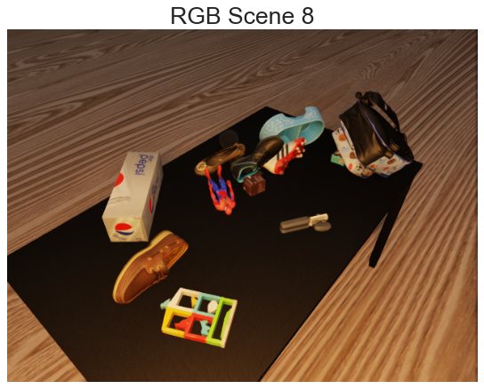
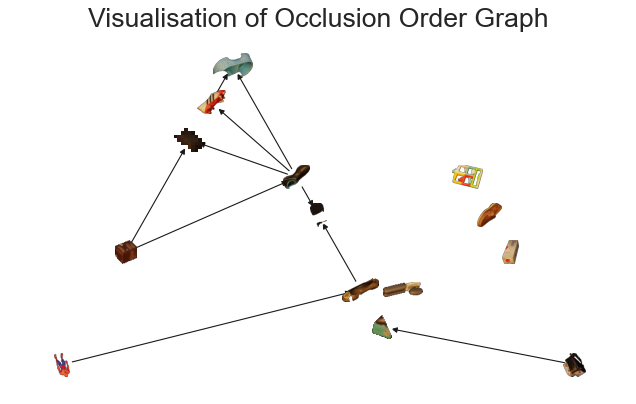
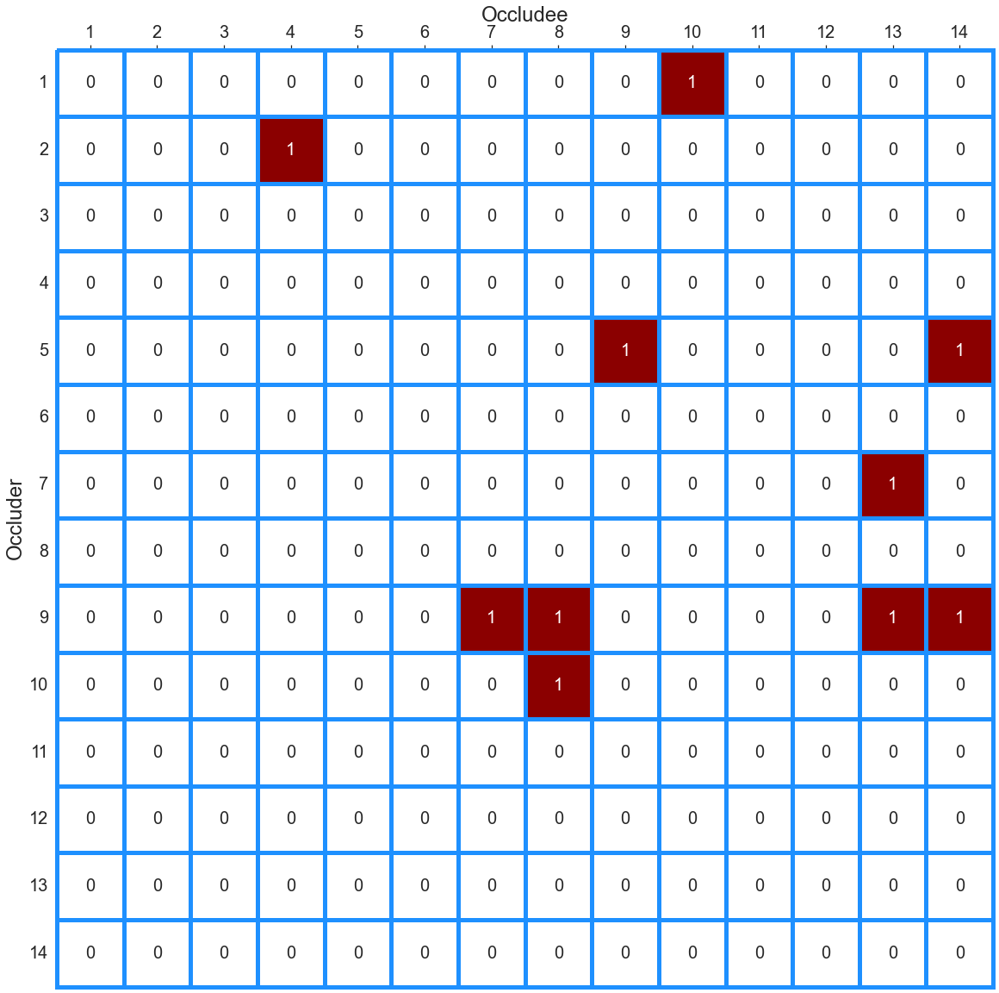

# SynTable - A Synthetic Data Generation Pipeline for Cluttered Tabletop Scenes


SynTable is a robust data generation pipeline that creates photorealistic synthetic datasets of Cluttered Tabletop Scenes. It includes object amodal masks, object modal (visible) masks, object invisible (occlusion) masks, object occlusion rate, object visible bounding box, scene's occlusion ordering adjacency matrix (OOAM) annotations for each scene.


# **Installation**
1. Change Directory to isaac_sim-2022.1.1 directory
``` bash
cd '/home/<username>/.local/share/ov/pkg/isaac_sim-2022.1.1/tools'
```

2. Clone the repo 
``` bash
git clone https://github.com/ngzhili/SynTable.git
```

3. Install Dependencies into isaac sim's python
- Get issac sim source code directory path in command line.
``` bash
SCRIPT_DIR="$( cd "$( dirname "${BASH_SOURCE[0]}" )" && pwd )"
echo $SCRIPT_DIR
```
- Get isaac sim's python path
``` bash
python_exe=${PYTHONEXE:-"${SCRIPT_DIR}/kit/python/bin/python3"}
echo $python_exe
```
- Run isaac sim's python
``` bash
$python_exe
```
- while running isaac sim's python in bash, install pycocotools and opencv-python into isaac sim's python
``` bash
import pip
package_names=['pycocotools', 'opencv-python'] #packages to install
pip.main(['install'] + package_names + ['--upgrade'])
```

4. Copy the mount_dir folder to your home directory (anywhere outside of isaac sim source code)
``` bash
cp -r SynTable/mount_dir /home/<username>
```

# **Generate Synthetic Dataset**

1. Change Directory to Isaac SIM source code
``` bash
cd /home/<username>/.local/share/ov/pkg/isaac_sim-2022.1.1
```
2. Run Syntable Pipeline (non-headless)
``` bash
./python.sh SynTable/syntable_composer/src/main1.py --input */parameters/train_config_syntable2.yaml --output */dataset/train --mount '/home/<username>/mount_dir' --num_scenes 3 --num_views 3 --overwrite --save_segmentation_data
```

### **Types of Flag**
| Flag           | Description |
| :---           |    :----:   |
| ```--input```  | Path to input parameter file.       |
| ```--mount```   | Path to mount symbolized in parameter files via '*'.        |
| ```--headless```   | Will not launch Isaac SIM window.        |
| ```--nap```   | Will nap Isaac SIM after the first scene is generated.        |
| ```--overwrite```   | Overwrites dataset in output directory.        |
| ```--output```   | Output directory. Overrides 'output_dir' param.        |
| ```--num_scenes```  | Number of scenes in dataset. Overrides 'num_scenes' param.       |
| ```--num_views```  | Number of views to generate per scene. Overrides 'num_views' param.      |
| ```--save_segmentation_data```  | Saves visualisation of annotations into output directory. False by default.      |

# **Visualise Annotations**
(to be filled)


# **Sample Annotations**

<!--- 
 
 -->
